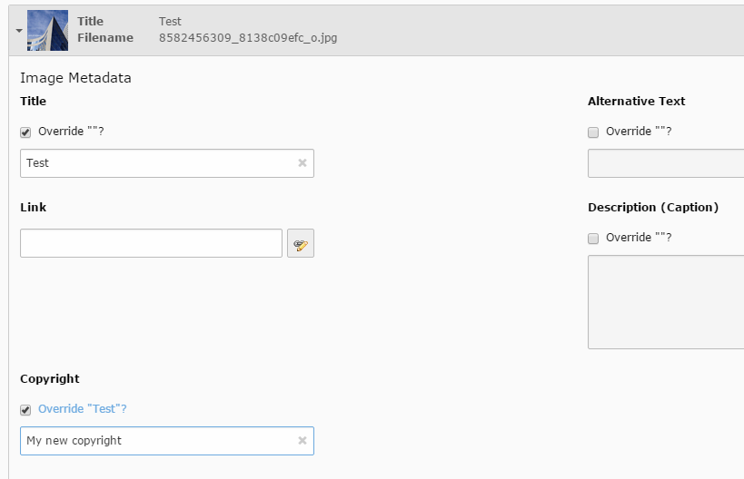

.. ==================================================
.. FOR YOUR INFORMATION
.. --------------------------------------------------
.. -*- coding: utf-8 -*- with BOM.

.. _start:

=============
Documentation
=============

What does it do?
==================

This extension will add the field "copyright" to every image file reference (imageOverlayPalette).
It's working like the fields for title, description (including the override from the file metadata).

All images with a copyright can be listed by a **provided plugin, for example in the imprint / disclaimer** of a page.
The list will show each pictures title or name with it's copyright and link to the page where the image is used.
*Bases on Extbase and Fluid.*

You can **enable a constant** to display the copyright of an image below it.

Installation
==================
* Install the extension from TER
* Include the static Typoscript
* Check the constant editor for specific configurations (you can display the copyright of each image below it, add alternative template paths or set a rootline PID to show only those copyright images in the plugin)
* You can add a copyright to an image in each file reference or in the filelist

Templating
==================

You can provide your own templates for the output by changing the constants.

To change the copyright text below images (if enabled) just change::

    tt_content.image.20.rendering.singleNoCaption.singleStdWrap.append.dataWrap = 
© |

Here you can change the markup example to a glyphicon with a tooltip from Bootstrap.

Google Image Sitemap XML
==================
By default the extension will create an Image Sitemap on **yourdomain.org/?type=1458065166** .
The sitemap contains ALL images used on the provided rootlines. So the sitemap also contains images without a copyright.
For now, only images with relations to "pages" and "tt_content" are within the sitemap. A feature to include also other records, e.g. from extensions like news, is planned.

You can disable the sitemap in the constant editor.

Issues and ToDos
==================

* The display of image copyrights in the frontend is only implemented for css_styled_content, yet.
* Add an extension setting to make the copyright field required
* The extension won't display pictures from workspaces in the list-plugin
* **When upgrading from older versions** you probably have to clear the cache in the install tool to enable the image sitemap page

Changelog
==================

You can find the changelog on github https://github.com/teamgeist/tgm_copyright/commits/master